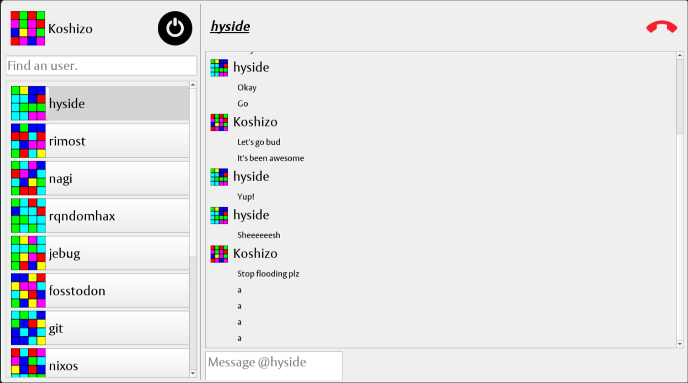

# Update the conan settings
- `conan remote add bincrafters https://bincrafters.jfrog.io/artifactory/api/conan/public-conan`
- `conan config set general.revisions_enabled=1`

# Linux build steps:

- `bash install.sh`

# Windows build steps:

- `.\install.ps1`

# Wiki

### Check our wiki for different guides: https://github.com/EpitechPromo2025/B-SYN-500-MPL-5-1-cpp-paul.comte/wiki
