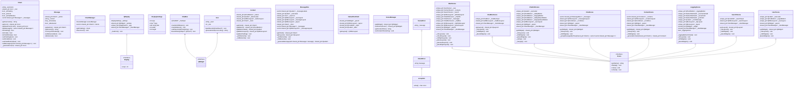

```mermaid
classDiagram

    class Client {
        +getUsername() string
        +getIcon() shared_ptr~Icon~
        +getNewIcon(int size) shared_ptr~Icon~
        +getMessages() vector~shared_ptr~Message~~
        +isChatting() bool
        +isInCall() bool
        +isChatWindow() bool
        +setChatting(bool) void
        +setInCall(bool) void
        +setChatWindow(bool) void
        +setMessages(vector~shared_ptr~Message~~) void
        -string _username
        -shared_ptr~Icon~ _icon
        -bool _isChatting
        -bool _isInCall
        -bool _isChatWindow
        -vector~shared_ptr~Message~~ _messages
        -_generateIcon(int) shared_ptr~Icon~
    }

    class Message {
        +getAuthor() shared_ptr~Client~
        +getContent() string 
        +const getTimestamp() void
        +setDelivered(bool) void
        +isDelivered() bool
        -shared_ptr~Client~ _author
        -string _content
        -long _timestamp
        -bool _isDelivered
    }

    class ClientManager {
        +SceneManager sceneManager
        +vector~shared_ptr~Client~~ clients
        +getChatting() Client
        +disconnect() void
    }

    class Display {
        +run()* int
    }

    QDisplay <|-- Display

    <<Interface>> Display

    class QDisplay {
        -_loadFont() void
        -DisplaySettings _settings
        -shared_ptr~QWidget~ _window
        -unique_ptr~QApplication~ _app
        -shared_ptr~ClientManager~ _clientManager
    }

    class DisplaySettings {
        +int argc
        +char **argv
        +std::string title
        +int width
        +int height
    }

    class QWidget
    <<Interface>> QWidget

    ChatBox <-- QWidget
    Icon <-- QWidget

    class ChatBox {
        +handleShiftReturn()  void
        +handleReturn() void
        +setPlaceholderText(string) void
        #eventFilter(QObject*, QEvent*) bool
        -QTextEdit* _chatInput
    }

    class Icon {
        #paintEvent(QPaintEvent*) void
        -string _seed
        -int _size
        -generateSeed(const string) string
    }

    class Contact {
        +getClient() shared_ptr~Client~
        +getButton() shared_ptr~QPushButton~
        +getButtonLabel() shared_ptr~QLabel~
        +getButtonLayout() shared_ptr~QHBoxLayout~
        +updateChatting() void

        -_joinElements() void
        -_initElements() void
        -shared_ptr~QPushButton~ _button
        -shared_ptr~QLabel~ _buttonLabel
        -shared_ptr~QHBoxLayout~ _buttonLayout
        -shared_ptr~Client~ _client
    }

    class MessageBox {
        +getClient() shared_ptr~Client~ 
        +getLayout() shared_ptr~QLayout~
        -_joinElements() void
        -_initElements() void
        -_generateMessage(std::shared_ptr~Message~ message) shared_ptr~QLabel~
        -vector~shared_ptr~QLabel~~ _messageLabels
        -shared_ptr~QLabel~ _userLabel
        -shared_ptr~Icon~ _userIcon
        -shared_ptr~QHBoxLayout~ _userLayout
        -shared_ptr~QVBoxLayout~ _messageLayout
        -shared_ptr~QHBoxLayout~ _layout
        -shared_ptr~Client~ _client
        -vector~shared_ptr~Message~~ _messages
        -vector~shared_ptr~QHBoxLayout~~ _messageLayouts
    }


    class NamedTextField {
        +getLayout() QHBoxLayout*
        -shared_ptr~QWidget~ _parent
        -shared_ptr~QHBoxLayout~ _layout
        -shared_ptr~QLineEdit~ _input
        -shared_ptr~QLabel~ _label
    }

    class SceneManager {
        +getWidget() shared_ptr~QWidget~
        +setScene(Scene*) shared_ptr~QWidget~
        +getContactFilter() string
        +setContactFilter(string) void
    }

    class exception {
        +what() char const *
    }

    class ClientError {
        -string message;
    }

    ClientError <|-- exception
    SceneError <|-- ClientError

    class SceneError {
        -string _message
    }

    class Scene {
        +getName() string
        +display() void
        +clear() void
        +refresh() void
    }

    <<Interface>> Scene

    MainScene <|-- Scene
    ChatBoxScene <|-- Scene
    ChatInfoScene <|-- Scene
    ChatScene <|-- Scene
    ContactScene <|-- Scene
    LoggingScene <|-- Scene
    SearchScene <|-- Scene
    UserScene <|-- Scene

    class MainScene {
        -_initLayouts() void
        -_initLeftLayout() void
        -_initRightLayout() void
        -_placeLayouts() void
        -_placeLeftLayout() void
        -_placeRightLayout() void
        -unique_ptr~UserScene~ _user
        -unique_ptr~ContactScene~ _contacts
        -unique_ptr~SearchScene~ _search
        -unique_ptr~QVBoxLayout~ _leftSideLayout
        -unique_ptr~ChatInfoScene~ _chatInfo
        -unique_ptr~ChatScene~ _messages
        -unique_ptr~ChatBoxScene~ _chatBox
        -unique_ptr~QVBoxLayout~ _rightSideLayout
        -unique_ptr~QHBoxLayout~ _parentLayout
        -shared_ptr~QWidget~ _parent
        -shared_ptr~ClientManager~ _clientManager
    }


    class ChatBoxScene {
        +getLayout() shared_ptr~QLayout~
        -_initLayouts() void
        -_initWidgets() void
        -_placeWidgets() void
        -unique_ptr~ChatBox~ _chatBoxInput
        -shared_ptr~QHBoxLayout~ _chatBoxLayout
        -shared_ptr~ClientManager~ _clientManager
    }


    class ChatInfoScene {
        +getWidget() shared_ptr~QWidget~
        -_initLayouts() void
        -_initWidgets() void
        -_placeWidgets() void

        -_callUp() void
        -_hangUp() void

        -unique_ptr~QLabel~ _userLabel
        -unique_ptr~QToolButton~ _callUpButton
        -unique_ptr~QToolButton~ _hangUpButton
        -unique_ptr~QToolButton~ _callUpAbsentButton
        -unique_ptr~QToolButton~ _hangUpAbsentButton
        -unique_ptr~QHBoxLayout~ _userLayout
        -shared_ptr~QWidget~ _parent
        -shared_ptr~ClientManager~ _clientManager
    }

    class ChatScene {
        +getWidget() shared_ptr~QWidget~
        -_initLayouts() void
        -_initWidgets() void
        -_groupMessagesByTime(shared_ptr~Client~) vector~vector~shared_ptr~Message~~~
        -vector~shared_ptr~MessageBox~~ _messages
        -shared_ptr~QVBoxLayout~ _messagesLayout
        -shared_ptr~QScrollArea~ _scrollArea
        -shared_ptr~QWidget~ _parent
        -shared_ptr~ClientManager~ _clientManager
    }


    class ContactScene {
        +getWidget() shared_ptr~QWidget~
        -_initLayouts() void
        -_initWidgets() void
        -_generateContact(shared_ptr~Client~) shared_ptr~Contact~
        -vector~shared_ptr~Contact~~ _contacts
        -shared_ptr~QVBoxLayout~ _contactsLayout
        -shared_ptr~QScrollArea~ _scrollArea
        -shared_ptr~QWidget~ _parent
        -shared_ptr~ClientManager~ _clientManager
    }


    class LoggingScene {
        _loggingButtonClicked() void
        _initLayouts() void
        _initWidgets() void
        _placeWidgets() void
        -unique_ptr~QPushButton~ _loggingButton
        -unique_ptr~NamedTextField~ _usernameField
        -unique_ptr~NamedTextField~ _serverField
        -unique_ptr~NamedTextField~ _portField
        -unique_ptr~QLabel~ _errorMessage
        -unique_ptr~QBoxLayout~ _topLayout
        -unique_ptr~QBoxLayout~ _layout
        -shared_ptr~QWidget~ _widget
        -shared_ptr~ClientManager~ _clientManager
        -bool _loggingAction
    }


    class SearchScene {
        +getLayout() shared_ptr~QLayout~
        -_initLayouts() void
        -_initWidgets() void
        -_placeWidgets() void
        -unique_ptr~QLineEdit~ _searchInput
        -shared_ptr~QHBoxLayout~ _searchLayout
        -shared_ptr~ClientManager~ _clientManager
    }

    class UserScene {
        +getWidget() shared_ptr~QWidget~
        -_initLayouts() void
        -_initWidgets() void
        -placeWidgets() void
        -unique_ptr~QLabel~ _userLabel
        -unique_ptr~QToolButton~ _logoutButton
        -unique_ptr~QHBoxLayout~ _userLayout
        -shared_ptr~QWidget~ _parent
        -shared_ptr~ClientManager~ _clientManager
    }
```
