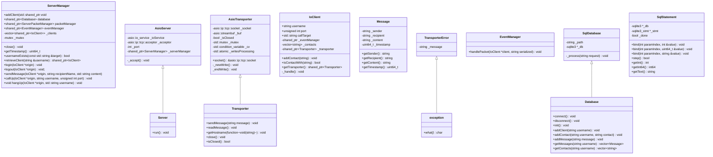

```mermaid
classDiagram

    class ServerManager {
        +close() void
        +getTimestamp() uint64_t
        +addClient(std::shared_ptr<IoClient> void
        +usernameExists(const std::string &target) bool
        +retrieveClient(string &username) shared_ptr~IoClient~
        +login(IoClient *origin) void
        +logout(IoClient *origin) void;
        +sendMessage(IoClient *origin, string recipientName, std::string content)
        +callUp(IoClient *origin, string username, unsigned int port) void
        +void hangUp(IoClient *origin, std::string username) void
        +shared_ptr~Database~ database
        +shared_ptr~ServerPacketManager~ packetManager
        +shared_ptr~EventManager~ eventManager
        -vector~shared_ptr~IoClient~~ _clients
        -mutex _mutex
    }

    class Server {
        +run() void
    }

    AsioServer <|-- Server

    class AsioServer {
        -_accept() void
        -asio::io_service _ioService
        -asio::ip::tcp::acceptor _acceptor
        -int _port
        -shared_ptr~ServerManager~ _serverManager
    }

    class Transporter {
        +sendMessage(string message) void
        +readMessage() void
        +getHostname(function~void(string)~) void
        +close() void
        +isClosed() bool
    }

    AsioTransporter <|-- Transporter

    class AsioTransporter {
        +socket() &asio::ip::tcp::socket
        -_newWrite() void
        _endWrite() void
        -asio::ip::tcp::socket _socket
        -asio::streambuf _buf
        -bool _isClosed
        -std::mutex _mutex
        -std::condition_variable _cv
        -std::atomic<int> _writesProcessing
    }

    class IoClient {
        +addContact(string) void
        +isContactWith(string) bool
        +getTransporter() shared_ptr~Transporter~
        +string username
        +unsigned int port
        +std::string callTarget

        -_handle() void
        -shared_ptr<EventManager> _eventManager
        -vector~string~ _contacts
        -shared_ptr~Transporter~ _transporter
    }

    class Message {
        +getSender() string
        +getRecipient() string
        +getContent() string
        +getTimestamp() uint64_t
        -string _sender
        -string _recipient
        -string _content
        -uint64_t _timestamp
    }

    class exception {
        +what() char*
    }

    TransporterError <|-- exception

    class TransporterError {
        -string _message
    }

    class EventManager {
        +handlePacket(IoClient *client, string serialized) void
    }

    class Database {
        +connect() void
        +disconnect() void
        +init() void
        +addClient(string username) void
        +addContact(string username, string contact) void
        +addMessage(string message) void
        +getMessages(string username) vector~Message~
        +getContacts(string username) vector~string~
    }

    SqlDatabase <|-- Database

    class SqlDatabase {
        -_process(string request) void
        -string _path
        -sqlite3 *_db
    }

    class SqlStatement {
        +bind(int paramIndex, int &value) void
        +bind(int paramIndex, uint64_t &value) void
        +bind(int paramIndex, string &value) void
        +step() bool
        +getInt() int
        +getInt64() int64
        +getText() string
        -sqlite3 *_db
        -sqlite3_stmt *_stmt
        -bool _done
    }
```
